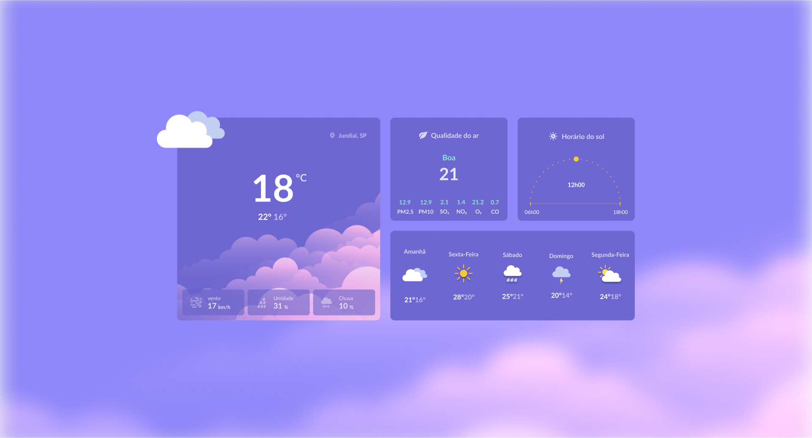
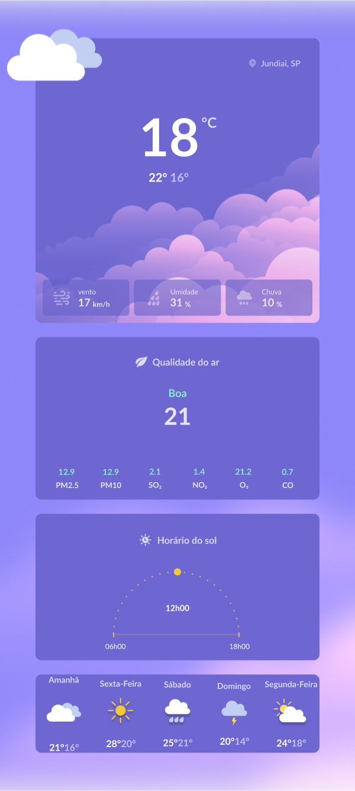

# Clima

Este projeto é o layout statico (os valores não estão sendo consumido por uma api) de uma aplicação de previsão do tempo, foi adicionado responsividade e o projeto foi desenvolvido usando HTML e CSS.

[Teste em tempo real](https://williamribeir0.github.io/Clima/)

